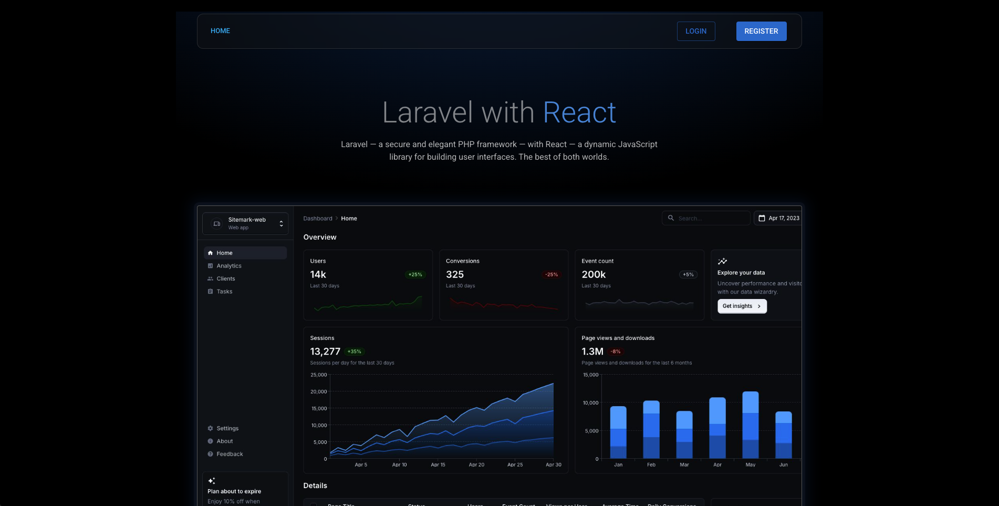

# boilerplate-laravel-react
Boilerplate with Laravel as Backend and React as Frontend

* Laravel 12 + Breeze + Inertiajs
* React 18 + Material UI 7
* Vite 6
* Sqlite

- composer create laravel/laravel:^12.0 .
- composer require laravel/breeze --dev

- php artisan breeze:install react
- php artisan migrate:fresh
- php artisan db:seed
- composer require fakerphp/faker

- npm install @mui/material @emotion/react @emotion/styled
- npm install @mui/icons-material
- npm install @mui/x-data-grid
- npm install @mui/x-date-pickers
- npm install dayjs

- npm run build

# Update composer.json
```
    "require": {
        "ext-pdo_sqlite": "*",
        "ext-sqlite3": "*"  
```
- composer update

# Update AppServiceProvider
```
use Illuminate\Support\Facades\URL;
public function boot(): void
{
    if ($this->app->environment('production')) {
        URL::forceScheme('https');
    }
}
```
# Update composer.json
"post-create-project-cmd": [
    "@php artisan key:generate --ansi",
    "@php -r \"file_exists('database/database.sqlite') || touch('database/database.sqlite');\"",
    "@php artisan migrate --graceful --ansi",
    "@php artisan db:seed --ansi"
],

# Clean Cache

- php artisan config:clear
- php artisan cache:clear
- php artisan view:clear
- php artisan route:clear
- composer dump-autoload

# Run Laravel Localhost

- php artisan serve --port=8080
- php artisan serve --host=0.0.0.0 --port=8080

# Setup .env

* Edit .env file

- APP_ENV=local
- APP_ENV=production

- APP_URL=http://localhost:8080
- APP_URL=https://react-app-ufgzz.ondigitalocean.app

- DB_CONNECTION=sqlite
- DB_DATABASE=./database/database.sqlite
- DB_DATABASE=../workspace/database/database.sqlite

# Update vite.config.js
```
server: {
    host: '0.0.0.0',
    port: 5173,
    strictPort: true,
    https: false,
    origin: 'http://localhost:5173',
    cors: true,
    hmr: {
        protocol: 'ws',
        host: 'localhost',
        clientPort: 5173,
    },
},
```

# View Interface

| Description | Link |
|-------------|------|
| Localhost | http://127.0.0.1:8080 |
| User | test@example.com |
| Password | password |

| Description | Link |
|-------------|------|
| Remote | https://react-app-ufgzz.ondigitalocean.app |
| User | test@example.com |
| Password | password |

  

  

# Digital Ocean Build Command
touch database/database.sqlite && npm run build && php artisan migrate --graceful --ansi --force && php artisan db:seed --ansi --force